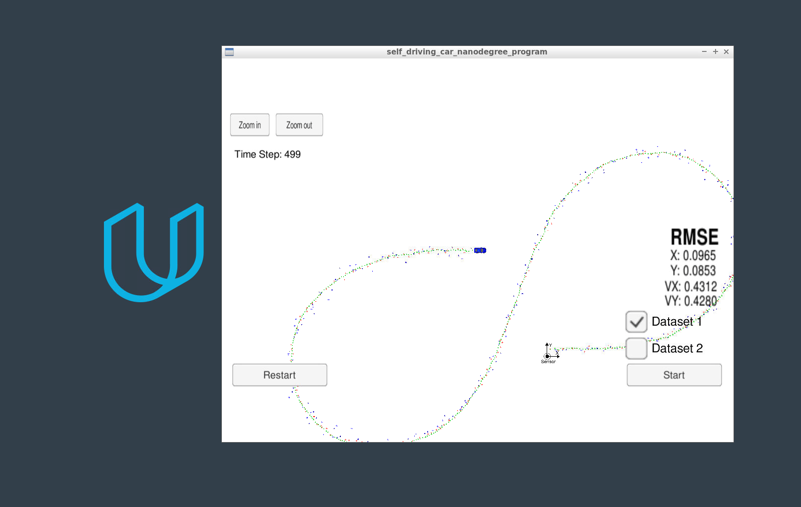

# Extended Kalman Filter Project Write Up
Self-Driving Car Engineer Nanodegree Program

This project implemeented an Extended Kalman Filter to estimate the state of a moving object of interest with noisy lidar and radar measurements. The "extended" aspect of the Kalman filter was that it used a Jacobian to linearize the input from the RADAR sensor.

The filter was able to achieve an px, py, vx, vy RMSE of [0.0965, 0.0853, 0.4312, 0.4280] which is lower than the values required in the project rubric. 

### General Extended Kalman Filter Methodology

The Kalman Filter approach is rather straightforward - it will take in a measurement, make a prediction about the location of the tracked object, and then corroborate this location with input from the sensors.

##Initiating the First Covariance Matrix

The aforementioned describes the steady state flow of the filter, but on start, the filter requires the state and covariance matrices to be initalized. In this specific implementation, the covariance matrix p_ and the state matrix x_. The covariance matrix describes the uncertainty of the sensor input - for the LiDAR this uncertainty is low, and the RADAR it is large - so I played with the values, and ended up setting it to be 0.1 the LIDAR and 1000 for the RADAR.

The initial state was initalized using the first available measurement for each sensor from the input.

### RADAR vs. LiDAR

What makes this project more challenging is that the two sensor inputs cannot be treated the same. First, the outputs of the sensor are fundamentally different, with the LIDAR returning x,y positions directly, whereas the RADAR returns range, yaw, and yaw rate. This has to be transformed back into the Cartesian space, but because the methods by which that is done requires a nonlinear function, the results must be linearized in order to work with this implementation. This linearization is the Extended Kalman Filter.

### Normalizing the Phi Range for the RADAR measurement

One issue I ran into was not bounding the phi value between -Pi and Pi. This resulted in a huge jump in the Vy RMSE at step 275, because there was a shift in heading which destablized the prediction.
