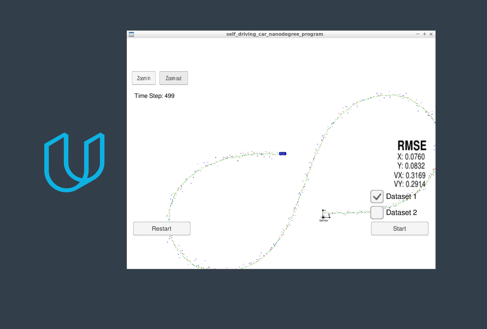

# Unscented Kalman Filter Project Write Up

This project implemeented an Extended Kalman Filter to estimate the state of a moving object of interest with noisy lidar and radar measurements. The "unscented" aspect of the Kalman filter was that it used signma values to transform non-linear results from one coordinate space to another.

The filter was able to achieve an px, py, vx, vy RMSE of [0.0760, 0.0832, 0.3169, 0.2014] which is lower than the values required in the project rubric. 




## Top Points of Discussion

### General Unscented Kalman Filter Methodology

The Unscented Kalman filter is different from the Extended Kalman Filter implemented previously in that both the LiDAR and RADAR are processed in the same fashion.

### Setting Sigma Points and Linearizing the Output

### Checking consistency of the Measurement

An additional feature that was implemented in the UKF project was calculating the Normalized Innovation Squared, or NIS, value. This value allows us to understand the consistency of our estimations, and allow us insight into our noise settings.

Using kai squared threshold of 5.991 because the LiDAR has two degrees of freedom:
```
LiDAR Consistency Count: 1 NIS LiDAR: 10.0954
LiDAR Consistency Count: 2 NIS LiDAR: 6.38945
LiDAR Consistency Count: 3 NIS LiDAR: 13.195
LiDAR Consistency Count: 4 NIS LiDAR: 6.90623
LiDAR Consistency Count: 5 NIS LiDAR: 6.28481
LiDAR Consistency Count: 6 NIS LiDAR: 8.34504
LiDAR Consistency Count: 7 NIS LiDAR: 7.11367
```

Using a kai squared threshold of 7.815 because the RADAR has three degrees of freedom:

```
RADAR Consistency Count: 1 NIS RADAR: 16.483
RADAR Consistency Count: 2 NIS RADAR: 11.6661
RADAR Consistency Count: 3 NIS RADAR: 11.6654
RADAR Consistency Count: 4 NIS RADAR: 8.76429
RADAR Consistency Count: 5 NIS RADAR: 9.98076
RADAR Consistency Count: 6 NIS RADAR: 10.8891
RADAR Consistency Count: 7 NIS RADAR: 8.92513
RADAR Consistency Count: 8 NIS RADAR: 8.91363
RADAR Consistency Count: 9 NIS RADAR: 8.46418
```

For roughly 500 time steps, neither sensor has great consistency. This would inform next steps on how to further tune and imporove the filter.