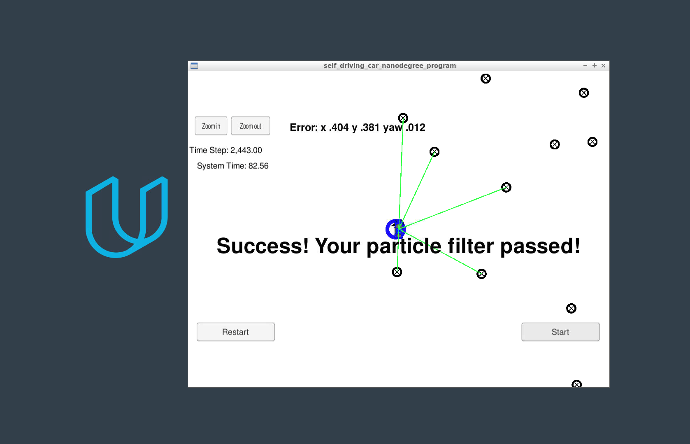

# Kidnapped Vehicle Project Write Up

This project implemented a particle filter that scanned the landscape, compared the sensor inputs with a list of known landmarks, and then produced a list of recognized objects.

### Particle Filter Methodology

Start with weak GPS coordinates.

Localize with a given map of landmarks.

Find the closest landmarks in the range of the sensor, and weight them accordingly.

Rinse and repeat.